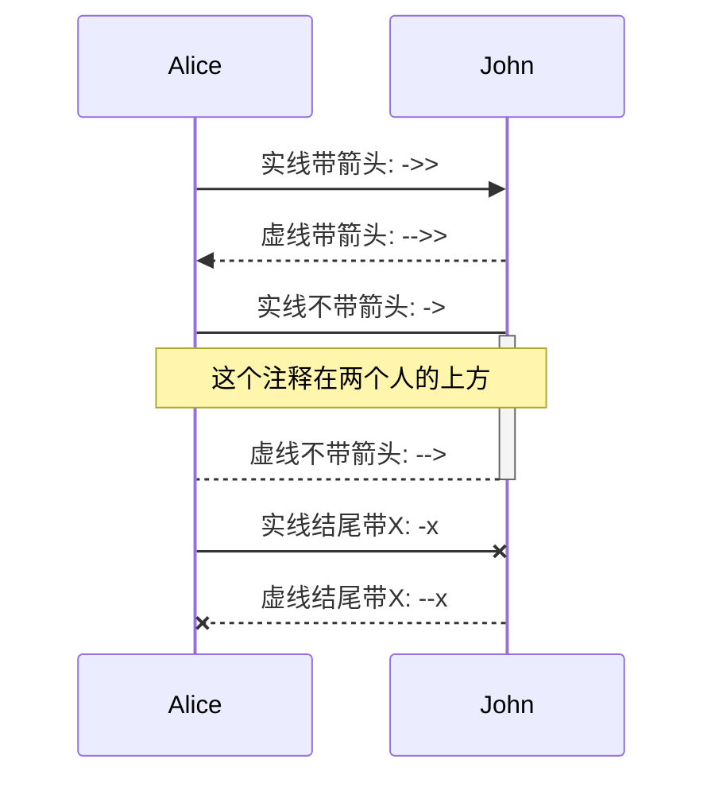
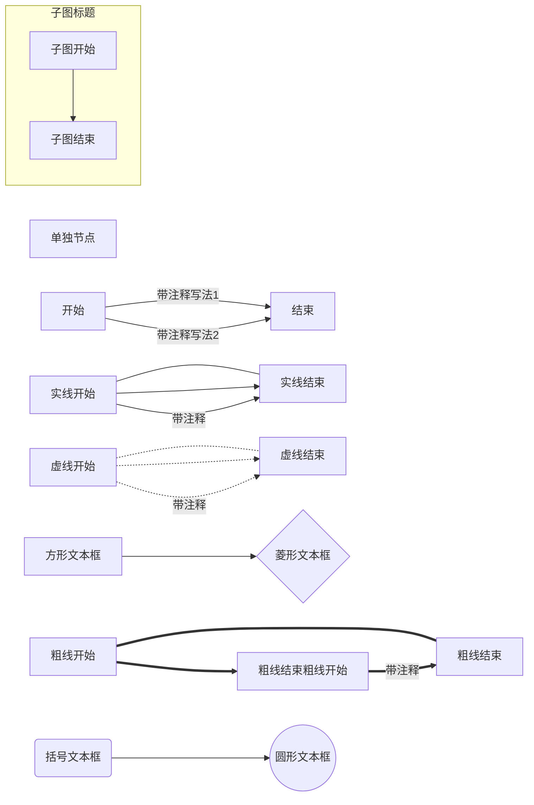

## 1. 排版
 
**粗体** *斜体* 
 
~~这是一段错误的文本。~~
 
引用:
 
> 为什么要写自己的博客, 原因是...
 
有充列表:
 1. 支持Vim
 2. 支持Emacs
 
无序列表:
 
 - 项目1
 - 项目2
 
 
## 2. 图片与链接
 
本地图片:


网页图片：


链接:
 
[这是去往CG Blog的链接](https://tjbnbb.github.io/)
 
## 3. 标题
 
以下是各级标题, 最多支持5级标题
 
```
# h1
## h2
### h3
#### h4
##### h4
###### h5
```
 
## 4. 代码
 
示例:
 
    function get(key) {
        return m[key];
    }
    
代码高亮示例:
 
``` javascript
/**
* nth element in the fibonacci series.
* @param n >= 0
* @return the nth element, >= 0.
*/
function fib(n) {
  var a = 1, b = 1;
  var tmp;
  while (--n >= 0) {
    tmp = a;
    a += b;
    b = tmp;
  }
  return a;
}
 
document.write(fib(10));
```
 
```python
class Employee:
   empCount = 0
 
   def __init__(self, name, salary):
        self.name = name
        self.salary = salary
        Employee.empCount += 1
```
 
# 5. Markdown 扩展
 
Markdown 扩展支持:
 
* 表格
* 定义型列表
* Html 标签
* 脚注
* 目录
* 时序图与流程图
* MathJax 公式
 
## 5.1 表格
 
Item     | Value
-------- | ---
Computer | \$1600
Phone    | \$12
Pipe     | \$1
 
可以指定对齐方式, 如Item列左对齐, Value列右对齐, Qty列居中对齐
 
| Item     | Value | Qty   |
| :------- | ----: | :---: |
| Computer | \$1600 |  5    |
| Phone    | \$12   |  12   |
| Pipe     | \$1    |  234  |
 
 
## 5.2 定义型列表
 
名词 1
:   定义 1（左侧有一个可见的冒号和四个不可见的空格）
 
代码块 2
:   这是代码块的定义（左侧有一个可见的冒号和四个不可见的空格）
 
        代码块（左侧有八个不可见的空格）
 
## 5.3 Html 标签
 
支持在 Markdown 语法中嵌套 Html 标签，譬如，你可以用 Html 写一个纵跨两行的表格：
 
    <table>
        <tr>
            <th rowspan="2">值班人员</th>
            <th>星期一</th>
            <th>星期二</th>
            <th>星期三</th>
        </tr>
        <tr>
            <td>李强</td>
            <td>张明</td>
            <td>王平</td>
        </tr>
    </table>
 
 
<table>
    <tr>
        <th rowspan="2">值班人员</th>
        <th>星期一</th>
        <th>星期二</th>
        <th>星期三</th>
    </tr>
    <tr>
        <td>李强</td>
        <td>张明</td>
        <td>王平</td>
    </tr>
</table>
 
**提示**, 如果想对图片的宽度和高度进行控制, 你也可以通过img标签, 如:
 

 
## 5.4 脚注
 
CG Blog[^footnote]来创建一个脚注

[^footnote]: CG Blog是菜狗的博客
 
## 5.5 目录
 
通过 `[TOC]` 在文档中插入目录, 如:
 
[TOC]
 
## 5.6 时序图与流程图
时序图：


流程图：

 
> **提示:** 更多关于时序图与流程图的语法请参考:
 
> - [时序图语法](http://bramp.github.io/js-sequence-diagrams/)
> - [流程图语法](http://adrai.github.io/flowchart.js)
 
## 5.7 MathJax 公式
 
$ 表示行内公式： 
 
质能守恒方程可以用一个很简洁的方程式 $E=mc^2$ 来表达。
 
$$ 表示整行公式：
 
$$\sum_{i=1}^n a_i=0$$
 
$$f(x_1,x_x,\ldots,x_n) = x_1^2 + x_2^2 + \cdots + x_n^2$$
 
$$\sum^{j-1}_{k=0}{\widehat{\gamma}_{kj} z_k}$$
 
更复杂的公式:
$$
\begin{eqnarray}
\vec\nabla \times (\vec\nabla f) & = & 0  \cdots\cdots梯度场必是无旋场\\
\vec\nabla \cdot(\vec\nabla \times \vec F) & = & 0\cdots\cdots旋度场必是无散场\\
\vec\nabla \cdot (\vec\nabla f) & = & {\vec\nabla}^2f\\
\vec\nabla \times(\vec\nabla \times \vec F) & = & \vec\nabla(\vec\nabla \cdot \vec F) - {\vec\nabla}^2 \vec F\\
\end{eqnarray}
$$